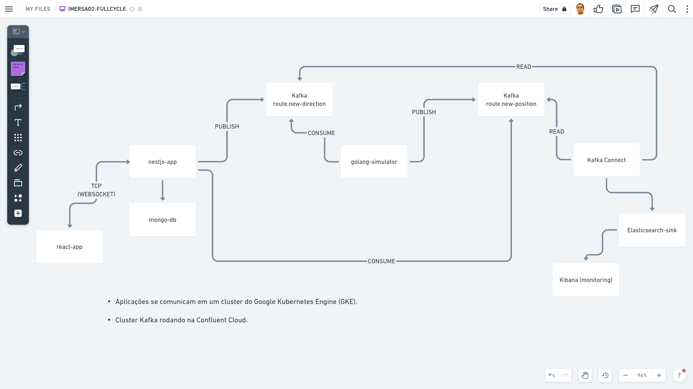
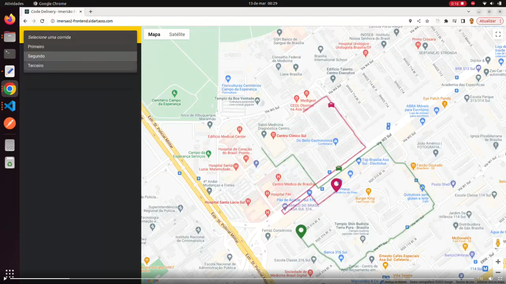

# Imersão #2 - Code Delivery

O projeto consiste em:

- Um sistema de entregas que permite visualizar em tempo real o veículo do entregador.

  - O sistema possibilita acompanhar diversas entregas ao mesmo tempo, exibindo os veículos andando em tempo real no mapa (_Google Maps_).

  - Utiliza um serviço simulador para enviar as posições em tempo real de cada entregador.

    - Por que um simulador?

      - O sistema precisa receber as posições para ir plotando no mapa os veículos se movimentando. Em um cenário real, uma aplicação _mobile_, por exemplo, poderia, de tempos em tempos, a partir da localização do usuário, disparar as posições do veículo para o servidor. Como o projeto não trabalha com um cenário real, é necessário simular um serviço responsável pelo envio das posições.

#### Que problemas de negócio o projeto poderia resolver?

- O projeto pode ser adaptado para casos de uso onde é necessário rastrear e monitorar carros, caminhões, frotas e remessas em tempo real, como na logística e na indústria automotiva.

Dentro da dinâmica do sistema:

1. A partir do _frontend_ (_Next.js_), é iniciada uma entrega para o destino X.
2. O simulador (_Go_) consume do _backend_ (_Nest.js_) via _Kafka_ a informação de que uma entrega foi iniciada.
3. A partir daí, o simulador começa a enviar as posições de latitude e longitude para o _Kafka_ a cada 0.5 segundo.
4. O _backend_ consome as informações que estão vindo do simulador via _Kafka_.
5. Assim que o _backend_ recebe a posição do veículo, ele começa a enviar os dados via _WebSocket_ para o _frontend_ para plotar no mapa (_Google Maps_) o veículo se movimentando.
6. Conforme o simulador manda as informações para o _Apache Kafka_, o _Kafka Connect_ ingere as informações que estão sendo enviadas pelo simulador e despeja no _ElasticSearch_.
7. O _Kibana_ acessa o _ElasticSearch_ para fazer a geração de gráficos e _dashboards_.

> REST

- #### Por que não enviar as posições através de um endpoint REST?

  - O simulador poderia enviar as posições diretamente ao _backend_ através de um _endpoint REST_. O que acontece é que o sistema que está recebendo a informação nem sempre está disponível 100% das vezes. Isso quer dizer que dados podem ser perdidos. E não perder nenhum dado sequer na requisição é um requisito do sistema.

  - #### Como garantir que nenhuma informação seja perdida?

    - Para evitar a perda de dados, é utilizado um sistema de mensageria ou de _stream_ como estratégia de resiliência. Ele será o responsável por enviar e receber os dados entre as aplicações.

> Kafka

- #### Por que Kafka?

  - Optou-se pela plataforma _Kafka_ porque resolve parte da complexidade técnica envolvida no caso de uso:

    - Garantia de entrega dos dados;

    - Auxilia na integração dos dados, através dos conectores que o _Kafka Connect_ oferece para ingerir dados de um sistema e despejar em outro, permitindo trabalhar com observabilidade;

> Tempo real

- #### Como atender ao requisito de tempo real?

  - O _Apache Kafka_ permite a comunicação entre sistemas em tempo real, principalmente porque possui latência muito baixa, de até 2 milissegundos no tempo de resposta.

  - Através do protocolo _WebSocket_, é possível exibir em tempo real a localização de cada veículo no mapa (_browser_).

  > WebSocket

  - O _WebSocket_ é um protocolo de comunicação que estabelece uma conexão _TCP_ a partir do _browser_ com o servidor. Ao invés de ficar enviando requisições _HTTP_, trabalha-se a partir de uma conexão persistente, onde é possível enviar e receber informações dentro do mesmo canal.

  - No projeto:

    - Assim que o _backend_ recebe as posições via _Kafka_ do simulador, o _backend_ envia via _WebSocket_ essa informação para o _frontend_.

> Observabilidade

- Os dados de entrega, bem como as posições, são armazenadas no _ElasticSearch_ para futuras análises.

  > 12 Fatores

  - #### Por que copiar os dados de um sistema para outro?

    - De forma geral, atualmente, as aplicações funcionam dessa forma. Para a geração de análises estatísticas, _BigData_, etc., é feito uma cópia dos dados da aplicação principal para outro sistema.
    - Isso tem a ver também com boas práticas, como as propostas na metodologia dos 12 Fatores (_Twelve-Factor App_). O fator 11, por exemplo, recomenda tratar _logs_ como fluxos de eventos. Ora, em ambientes de _deploy_ de microsserviços, gerenciado por _clusters Kubernetes_, _PODs_ são automaticamente criados e destruídos a todo momento. Com isso, _logs_ de arquivos físicos são perdidos. Tratar _logs_ como fluxos de eventos e armazená-los em ferramentas de gerenciamento de _logs_, com o _ELK Stack - ElasticSearch, Logstash e Kibana_, permite acompanhar _logs_ em tempo real e até criar alertas de monitoramento.

  > Kafka Connect

  - #### Como vai integrar os dados entre sistemas?

    - Os dados que saem do simulador e vão para o _Kafka_ vão parar no _Kafka Connect_. O _Kafka Connect_ é uma ferramenta que auxilia na integração entre sistemas e, neste caso, todas as informações vão ser enviadas automaticamente para o _ElasticSearch_. Uma vez que isso acontece, é possível construir _dashboards_ no _Kibana_ para visualizar, por exemplo:

      - A quantidade de entregas que aconteceram;
      - Quantos _browsers_ estão abertos vendo as corridas acontecerem;
      - Os mapas mostrando o trajeto de cada rota feita em relação às entregas;
      - Quais rotas estão sendo mais requisitadas;
      - A quantidade de entregas por rota.

> Escalabilidade

- A arquitetura foi projetada para ser escalável. Nesse sentido:

  - Ao subir as aplicações no _Kubernetes_, conforme uma aplicação estiver tendo mais acessos ou menos acessos, um objeto _HorizontalPODAutoscaler_ (_HPA_) consegue fazer o próprio _Kubernetes_ escalar os _PODs_ para a aplicação segurar bem a carga.

    > Autoscaling com HPA

    - Um objeto _HPA_ permite escalar a quantidade de réplicas (_PODs_) ao definir-se a quantidade de recursos - por exemplo, porcentagem de _CPU_ - que cada _POD_ pode consumir.

## Tecnologias

- #### Backend
  - TypeScript
  - Nest.js
  - Apache Kafka
  - Golang
  - Kafka Connect
  - MongoDB
- #### SPA (Single Page Application)
  - TypeScript
  - React.js
- #### Deploy
  - Kubernetes no GKE
- #### Apache Kafka
  - Serviço gerenciado na Confluent Cloud
- #### Observabilidade
  - ElasticSearch
  - Kibana

### Execução

